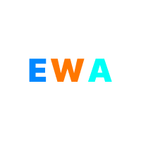
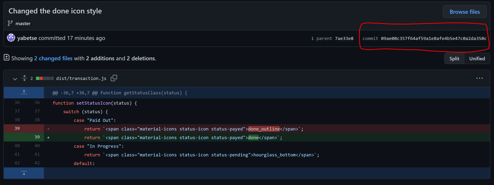

<div id="top"></div>

<!-- PROJECT LOGO -->
<br />
<div>
  <a href="hhttps://github.com/yabetse/ewa-cdn">
    
  </a>

  <h2>EWA-CDN</h2>

  <p>
    This repo serves as a jsDeliver CDN for Earned Wage Access project 
</div>


<br />

<!-- USAGE EXAMPLES -->
## Usage

In order to reflect the latest changes, use the most recent commit id specific to a file you're trying access via **jsDeliver**. You can see the latest commit id under commits.



Once you get the right commit id, it's straight forward to add it to the **jsDeliver** CDN link.

```
https://cdn.jsdelivr.net/gh/['owner']/['repo']@['commit-id']/['path to file']
```

For example, for the change shown in the picture above, the CDN link to get the latest changes is 

[https://cdn.jsdelivr.net/gh/yabetse/ewa-cdn@09ae00c357f64af59a1e8afe4b5e47c0a2da350c/dist/transaction.min.js](https://cdn.jsdelivr.net/gh/yabetse/ewa-cdn@09ae00c357f64af59a1e8afe4b5e47c0a2da350c/dist/transaction.min.js%27%60)

<br />


For releases, create a release branch then change the "commit-id" with `latest` keyword.

```
https://cdn.jsdelivr.net/gh/['owner']/['repo']@latest/['path to file']
```

[https://cdn.jsdelivr.net/gh/yabetse/ewa-cdn@latest/dist/transaction.min.js](https://cdn.jsdelivr.net/gh/yabetse/ewa-cdn@latest/dist/transaction.min.js%60)

